# Projeto DSI - Sistema de Listagem de Filmes

Este projeto foi desenvolvido como parte da disciplina de Desenvolvimento de Sistemas de Informação (DSI), com o objetivo de aplicar conceitos de front-end, back-end e banco de dados em um sistema completo de Listagem de Filmes utilizando React Native.

## 💻 Tecnologias Utilizadas

* ⚛️ **Framework: React Native**  
  Framework utilizado para o desenvolvimento do app mobile com **TypeScript**, aplicando conceitos de orientação a objetos.

* 🧠 **Dataset:**  [Millions of Movies – Kaggle](https://www.kaggle.com/datasets/akshaypawar7/millions-of-movies)  

* 🔐 **Banco de dados: Firebase**  
  - **Autenticação de usuários** com login seguro;
  - **Banco de dados em tempo real**, responsável por armazenar e gerenciar os dados do aplicativo na nuvem.

* 📦 **Gerenciamento de Dependências: npm**  
  Utilização do **Node Package Manager** para instalação e controle das bibliotecas e pacotes utilizados no projeto.

## 📷 Imagens do Sistema
### Telas de Acesso e Navegação
<p align="center">
  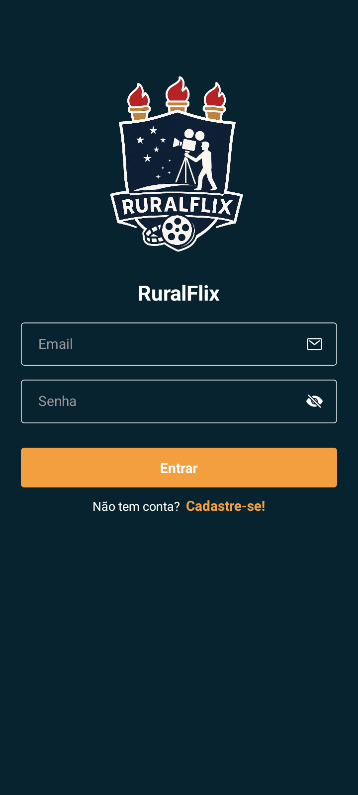
  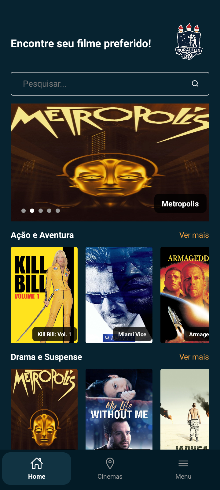
  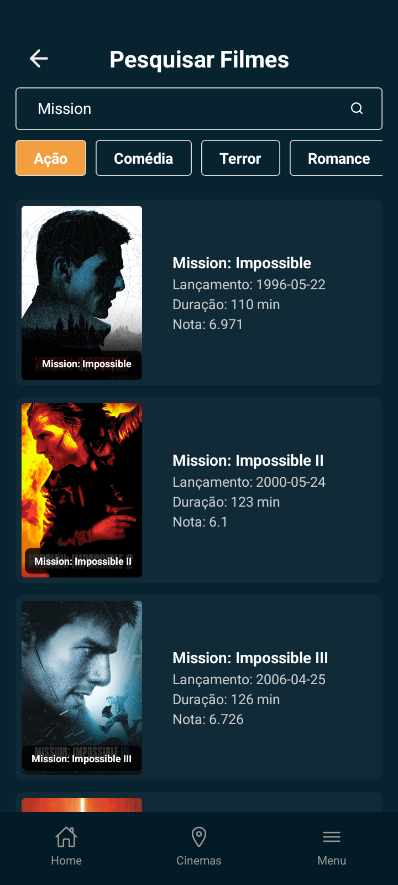
  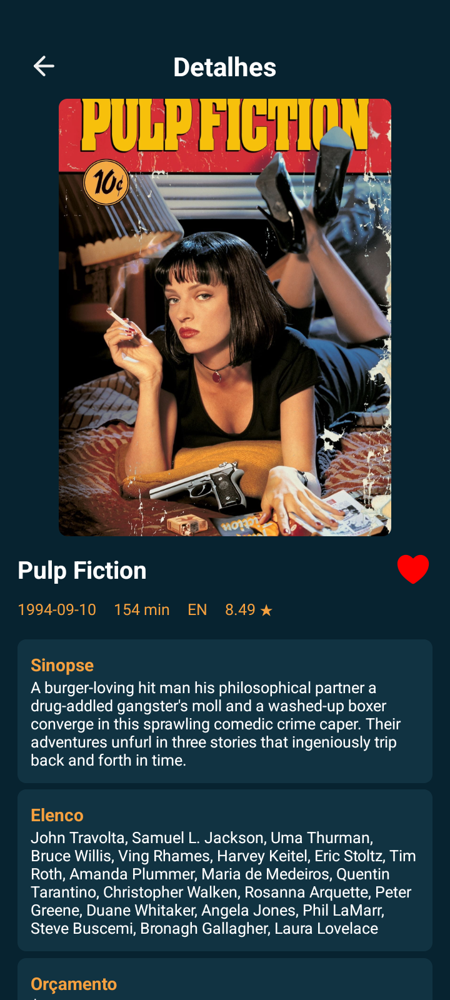
</p>
<p align="center">
  <i>Tela de Login, Página Inicial, Pesquisa e Detalhes.</i>
</p>

---
### Funcionalidades
<p align="center">
  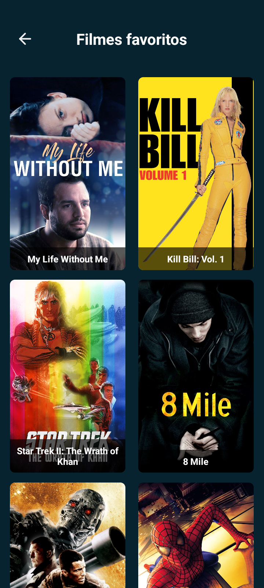
  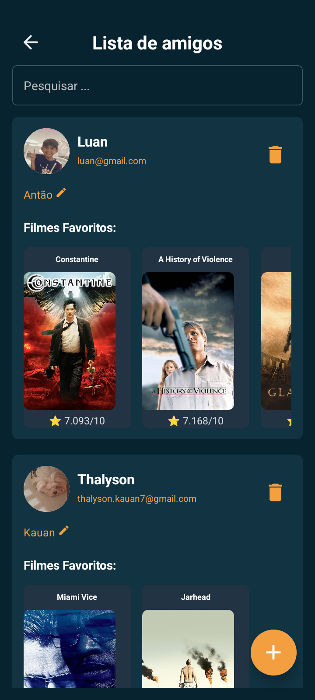
  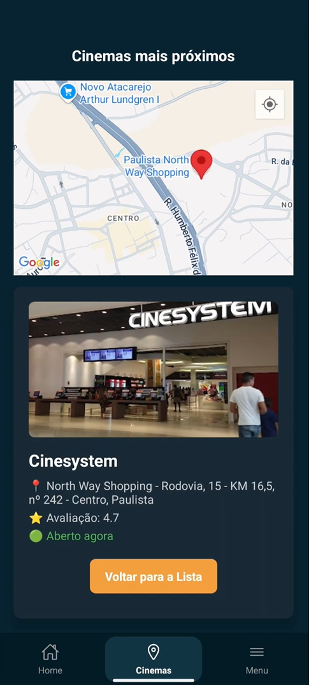
  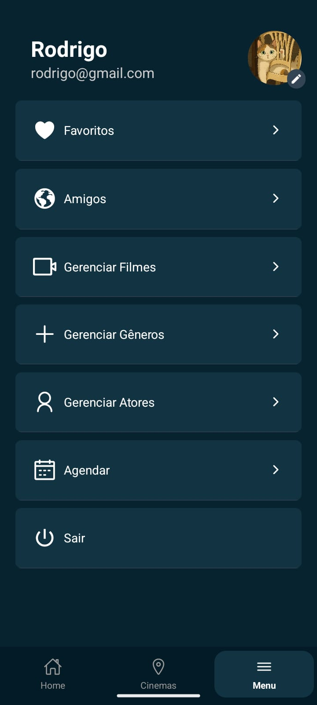
</p>
<p align="center">
  <i>Tela de Favoritos, Amigos, Cinemas Próximos e Menu.</i>
</p>

---
### Gerenciamento
<p align="center">
  
  
  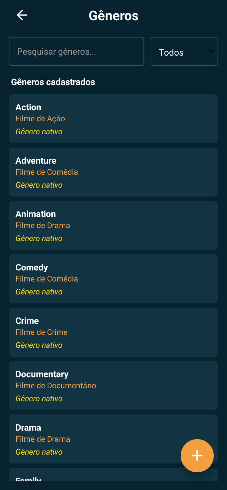
  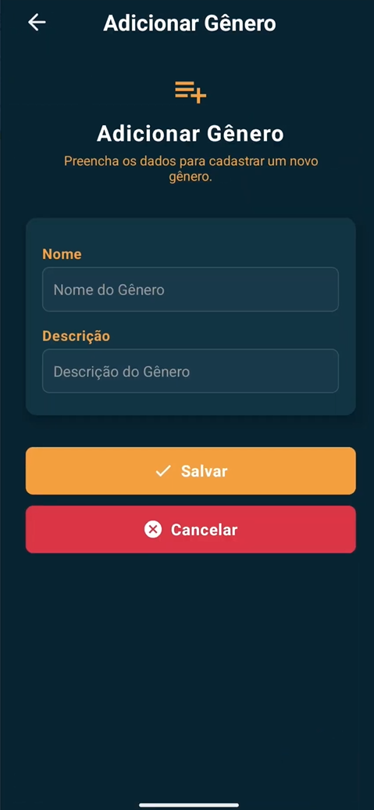
</p>
<p align="center">
  <i>Gerenciamento de Filmes e Gêneros</i>
</p>

<p align="center">
  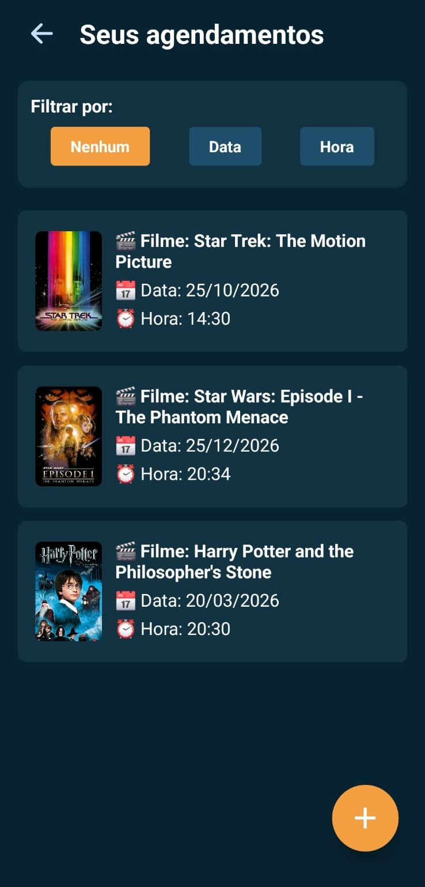
  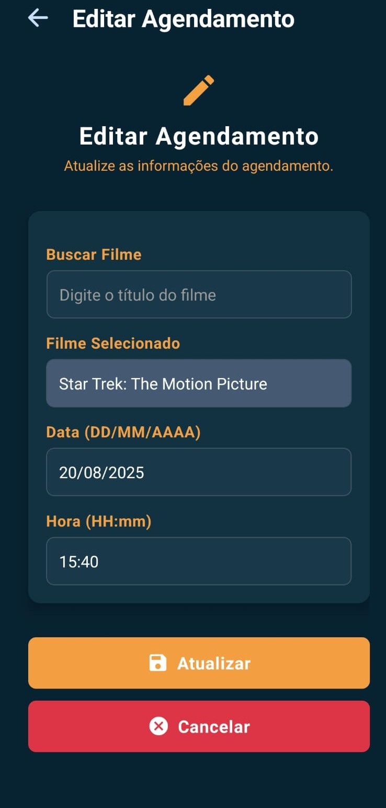
  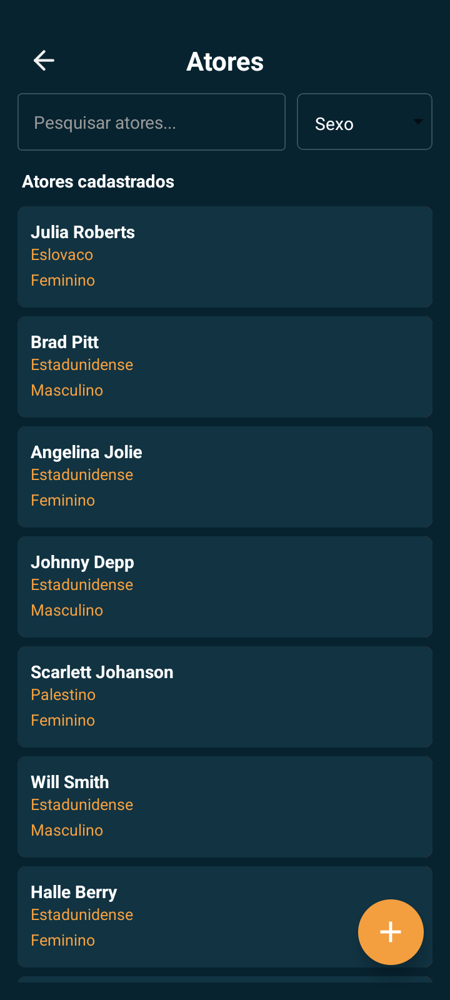
  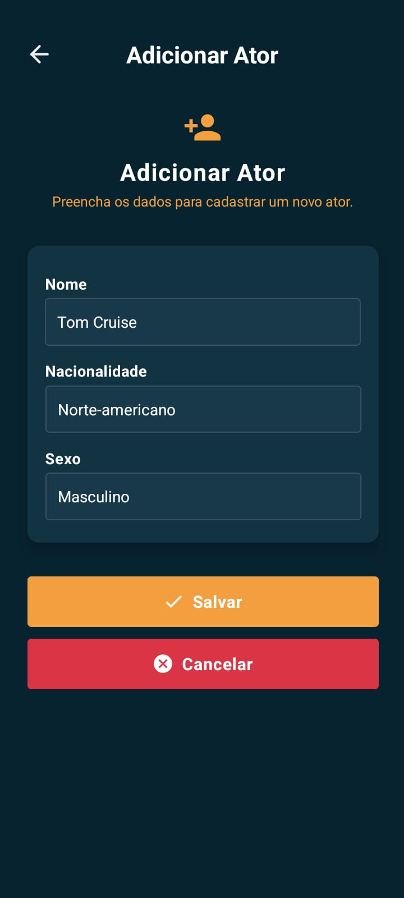
</p>
<p align="center">
  <i>Gerenciamento de Agendamentos e Atores</i>
</p>

## 👨‍💻 Desenvolvedores

| Nome                | E-mail                     |
|---------------------|-----------------------------|
| Gabriel Vinícius     | gabrielvto18@gmail.com   |
| Luan Vinícius     | limaluan32104@gmail.com   |
| Rodrigo Santana     | rodrigosantana.dev@gmail.com   |
| Victor de Souza     | victorsouza183@gmail.com   |
| Thalyson Kauan    | thalyson.kauan7@gmail.com |


## 🚀 Como Executar
1. Clone o repositório:
```bash
git clone https://github.com/rodrigosantana24/projeto-dsi.git
cd projeto-dsi
npm install
npx expo start
