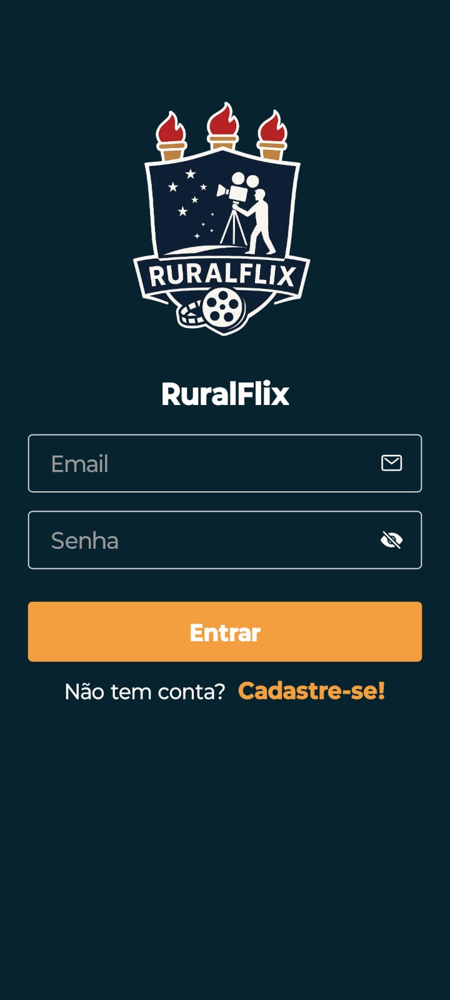
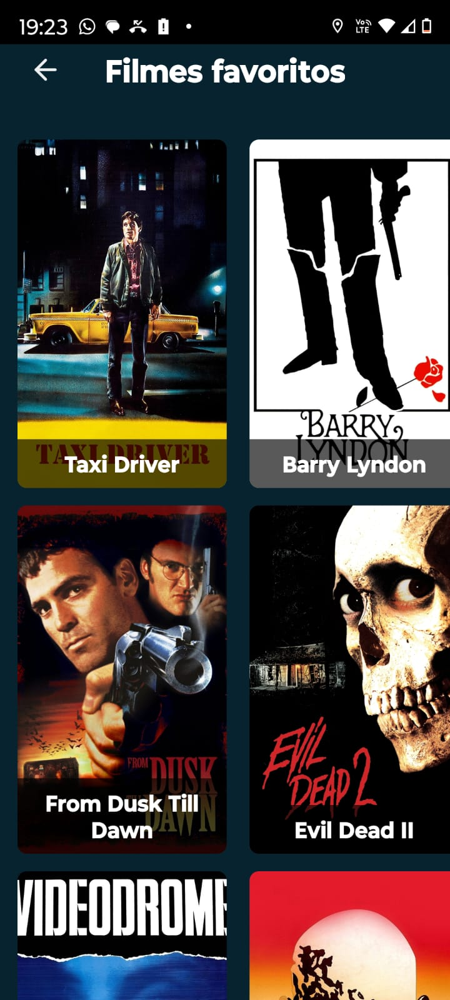

# Projeto DSI - Sistema de Listagem de Filmes

Este projeto foi desenvolvido como parte da disciplina de Desenvolvimento de Sistemas de Informação (DSI), com o objetivo de aplicar conceitos de front-end, back-end e banco de dados em um sistema completo de Listagem de Filmes utilizando React Native.

## 💻 Tecnologias Utilizadas

- 💻 **Framework** : React Native
- 🧠 **Data-Set**: https://www.kaggle.com/datasets/akshaypawar7/millions-of-movies
- 💾 **Banco de Dados** : FireBase
- 🔐 **Login com autenticação** : FireBase
- 📦 **Gerenciamento de dependências** : npm

## 📷 Imagens do Sistema
<p align="center">
  
  
  
  
  
  
  
</p>

## 👨‍💻 Desenvolvedores

| Nome                | E-mail                     |
|---------------------|-----------------------------|
| Victor de Souza     | victorsouza183@gmail.com   |


## 🚀 Como Executar
1. Clone o repositório:
```bash
git clone https://github.com/rodrigosantana24/projeto-dsi.git
cd projeto-dsi
npm install
npx expo start
